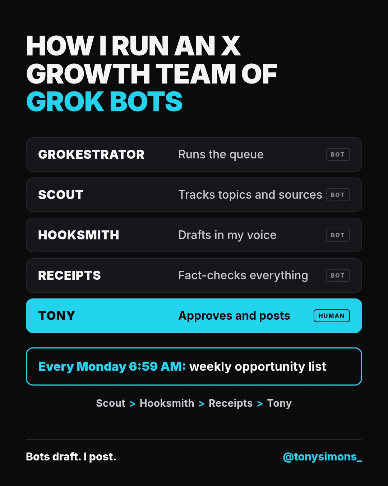

# 🐦 @tonysimons_

## 📅 October 09, 2026

> 12 post(s) archived.

---

### 🕐 18:09 UTC · @tonysimons_

> Omarchy Stans, time to turn on those notifications to stay on top of everything! Omarchy is now officially on X! Thanks to our friends at @SpaceXAI 🙏

🔗 [View original post](https://x.com/tonysimons_/status/2108620900681621613)

---

### 🕐 17:08 UTC · @tonysimons_

> I’m always on the back and forth with my Hermes. Constantly learning. Constantly growing. Solid tip from the home @HermesWatcher here! 👇🏻 Correcting your agent once is fine. Correcting the exact same thing every time you start a new chat gets old fast. With Hermes, you can turn that correction into a saved preference. Don’t like headings? Tell it. Want shorter responses? Tell it. Prefer a certain format? Tell it. S…

🔗 [View original post](https://x.com/tonysimons_/status/2108605638712442917)

---

### 🕐 15:35 UTC · @tonysimons_

> The rules every bot follows: - My own tests, opinions, and experience are the core. If a draft is missing my take, the bot asks me for it. - Anything it isn&apos;t sure of gets marked for a fact-check. - No engagement bait. - Affiliate links and sponsored posts get flagged for X&apos;s Paid Partnership label.

🔗 [View original post](https://x.com/tonysimons_/status/2108582021119291631)

---

### 🕐 15:35 UTC · @tonysimons_

> What I&apos;ve learned so far: Grok Bot is a simple solution if you don&apos;t have the technical expertise or the time to tinker. It&apos;s very easy to set up and get running. It’s still not open source like Hermes Agent 🪽, but it’s absolutely staying in my stack!

🔗 [View original post](https://x.com/tonysimons_/status/2108582024646939089)

---

### 🕐 15:35 UTC · @tonysimons_

> My X growth team is 4 Grok Bots and me. The bots draft. I approve and post every post myself. Here&apos;s the full setup, cheat-sheet style.

🔗 [View original post](https://x.com/tonysimons_/status/2108582009241051454)

---

### 🕐 15:04 UTC · @tonysimons_

> Step 5 Preview is free on Nous Portal right now! And it looks to do a pretty solid job at front-end work, too! 👇🏻 Step 5 Preview + Hermes Agent. Front end UI. Playstation edition.

🔗 [View original post](https://x.com/tonysimons_/status/2108574334851711192)

---

### 🕐 13:50 UTC · @tonysimons_

> 100% “Grok Bot is so easy to use. Why would anyone use Hermes Agent now?” To avoid shit like this. That’s why. Among many other reasons. Hermes is YOUR agent. 🪽 Do as YOU please. Not as the billionaires tell you to do. 👇🏻

🔗 [View original post](https://x.com/C_lxndr/status/2108555641220436435)

---

### 🕐 12:26 UTC · @tonysimons_

> GM + TGIF! 🙌🏻 Do you let your Hermes Agent have access to your main Chrome profile and passwords? 🤔

🔗 [View original post](https://x.com/tonysimons_/status/2108534605326193138)

---

### 🕐 05:27 UTC · @tonysimons_

> What’s one thing Hermes should NEVER do automatically, no matter how smart agents get?

🔗 [View original post](https://x.com/tonysimons_/status/2108429163342463472)

---

### 🕐 03:38 UTC · @tonysimons_

> 35 BILLION parameters. Running on my desk. 🤯 Just fired up Ornith 1.5 35B locally in Hermes Agent on my 48GB Mac mini. I&apos;m ONE prompt in and already blown away by the speed. No cloud inference. No token meter ticking. I FINALLY get to experience local AI firsthand. This changes EVERYTHING. 

🔗 [View original post](https://x.com/tonysimons_/status/2108401750487011339)

---

### 🕐 03:02 UTC · @tonysimons_

> Wait. So we&apos;re building AND signing iPhone apps on LINUX now?! No macOS. No Xcode install. And they&apos;ve already got Flutter apps running on a real iPad. This is the kind of open-source shit I LOVE to see. Omarchy just keeps getting more ridiculous. 🔥 Everyone says you need a Mac to build iPhone apps. Now Flutter apps build on Linux too. @agrxculture sent three PRs to omarchy-apple-dev, and it builds and signs a Flutter iPhone app in 29 seconds. No Mac. Just Omarchy Linux. It&apos;s all open source: https://github.com/joshuaswarren…

🔗 [View original post](https://x.com/tonysimons_/status/2108392586369257751)

---

### 🕐 01:20 UTC · @tonysimons_

> I like a lot Grok Bot. But having Hermes available anywhere I want, with whoever I want, using any model I want, with different profiles, hosted where I want, is priceless to me even if it requires more work to setup. When it’s done it’s truly yours with a memory you can keep with you for any provider you want to use. “Grok Bot is so easy to use. Why would anyone use Hermes Agent now?” To avoid shit like this. That’s why. Among many other reasons. Hermes is YOUR agent. 🪽 Do as YOU please. Not as the billionaires tell you to do. 👇🏻

🔗 [View original post](https://x.com/o_b/status/2108366974124249368)

---
