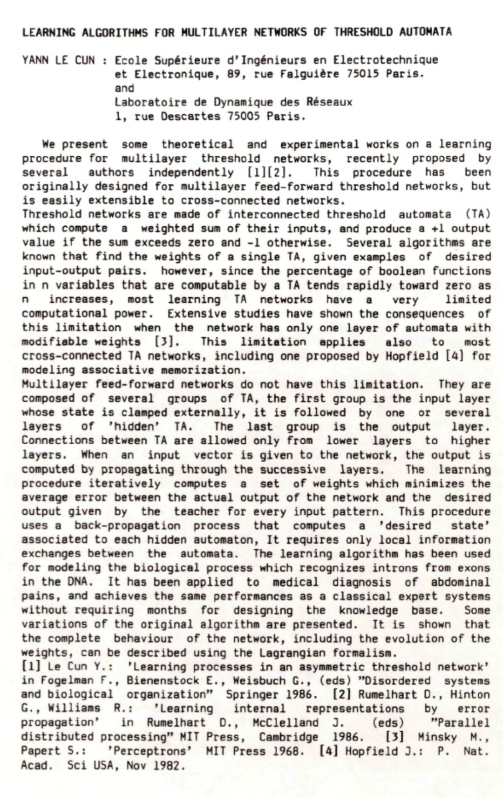
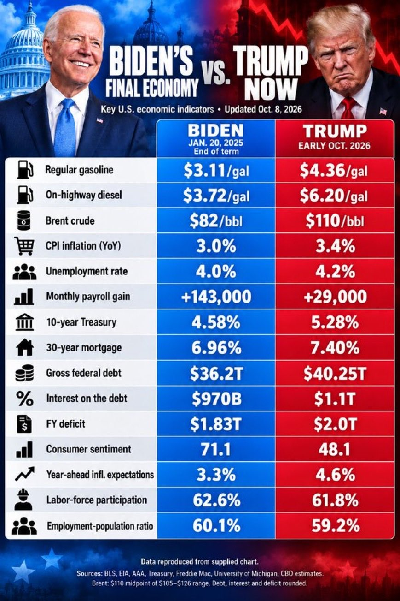

# 🐦 @ylecun

## 📅 October 09, 2026

> 4 post(s) archived.

---

### 🕐 09:58 UTC · @ylecun

> Sessions for the ELLIS UnConference are online! Kicking off with two sessions on World Models 🌍, including a 30-min tutorial by @ylecun! 🔎 Sessions: https://ellis-unconference.github.io/#sessions ❗ Register: https://ellis-unconference.github.io/#registration Heading to @EurIPSConf in Paris? Join us a day early on Dec 8! Media

🔗 [View original post](https://x.com/ELLISforEurope/status/2108497254591926716)

---

### 🕐 05:19 UTC · @ylecun

> June 1986. It was my first conference in the US and my first time visiting MIT. Had a poster on multilayer nets. I met Marvin Minsky for the first time at the reception hosted by Thinking Machines Inc (the original one that built the Connection Machine). He was surprised that you could train a neural net to compute the product of two binary numbers (I had done the experiment). I was on my way to the first Connectionist Summer School at CMU. The Bell Labs folks, who I met the year before, heard I was in the US and invited me for a talk in Holmdel on my way back to Paris.

🔗 [View original post](https://x.com/ylecun/status/2108427038562373648)

---

### 🕐 05:08 UTC · @ylecun

> Let&apos;s be clear, the free world has nothing to learn about western values &amp; civilisation from MAGA USA. Most of us can see what Vance &amp; Rubio really are, as they strut around Europe telling us where we went wrong. They should clean up their own filthy &amp; stinking yard, a country of botched executions &amp; now a return to public executions. A cesspit where milliions of its citizens can&apos;t afford decent health care &amp; thousands die each year due to archaic gun laws. It&apos;s a country that routinely breaks international law. Worst of all, it&apos;s a nation in thrall to a corrupt &amp; criminal authoritarian leader who is all that Christianity, liberal democacy, the Renaissance &amp; the Enlightenment were not &amp; are not. MAGA has only one thing to teach us; the urgent need to avoid sliding back into barbarism. Thank you for your attention to this matter.

🔗 [View original post](https://x.com/ianrich15813274/status/2108424221525217427)

---

### 🕐 02:38 UTC · @ylecun

> Goodnight 🌙

🔗 [View original post](https://x.com/mjfree/status/2108386631204106426)

---
