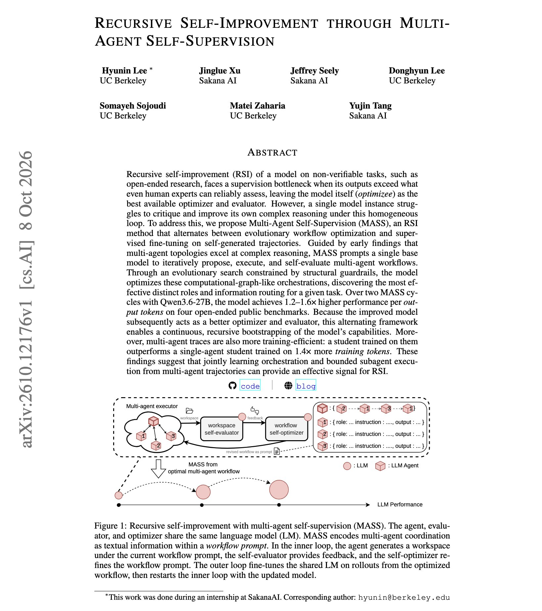

# 🐦 @dair_ai

## 📅 October 10, 2026

> 1 post(s) archived.

---

### 🕐 14:55 UTC · @dair_ai

> Recommended paper from Sakana AI on recursive self-improvement. They propose an interesting way to scale recursive self-improvement through multi-agent self-supervision. In this line of research, self-improvement loops usually need an external verifier, so open-ended tasks without a checker are left out. MASS removes that requirement. One base model proposes multi-agent workflows, runs them and grades them, and an evolutionary search keeps the workflows that score best. The model is then fine-tuned on its own traces, and the improved model starts the next cycle as a better optimizer and grader. Two cycles on Qwen3.6-27B raise performance per output token from 1.2 to 1.6x on four open-ended benchmarks. A student trained on multi-agent traces also beats a single-agent student trained on 1.4x more tokens. Paper: https://arxiv.org/abs/2610.12176 Chat with Paper: https://academy.dair.ai/papers/recursive-self-improvement-through-multi-agent-self-supervision-2610.12176

🔗 [View original post](https://x.com/omarsar0/status/2108934334589857850)

---
