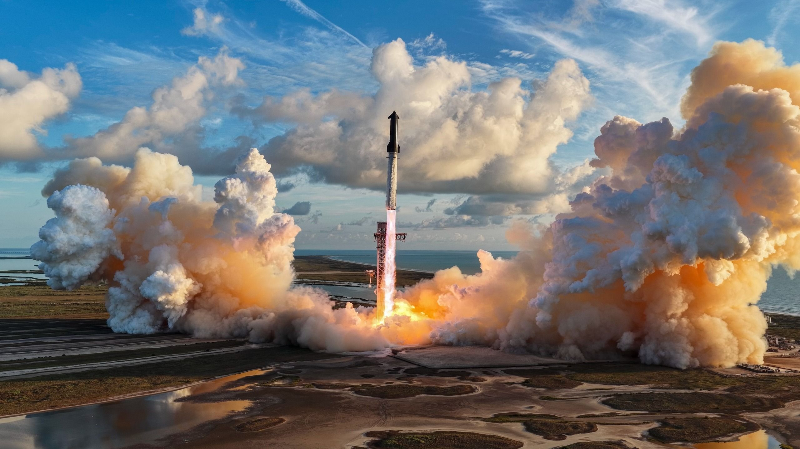
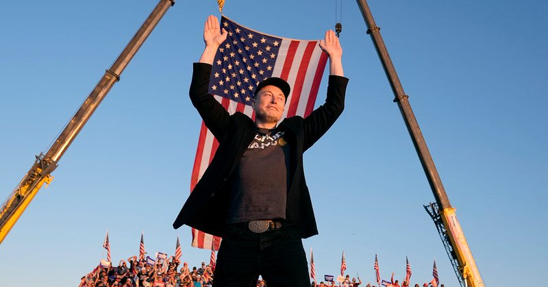
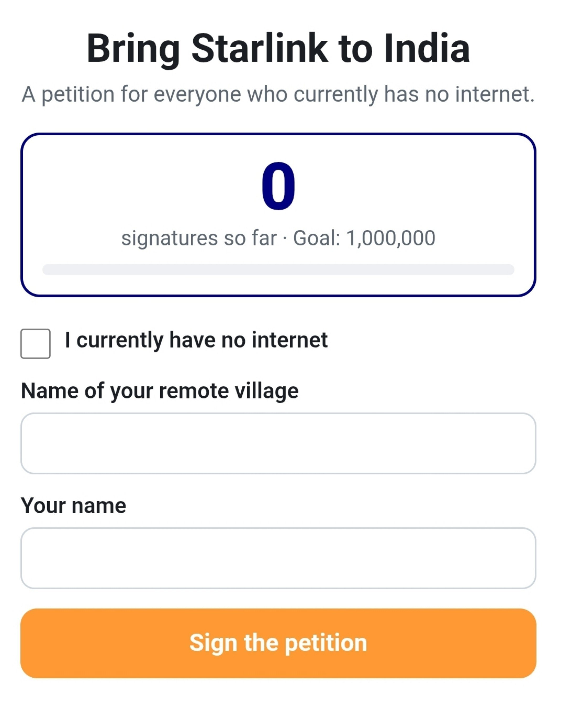
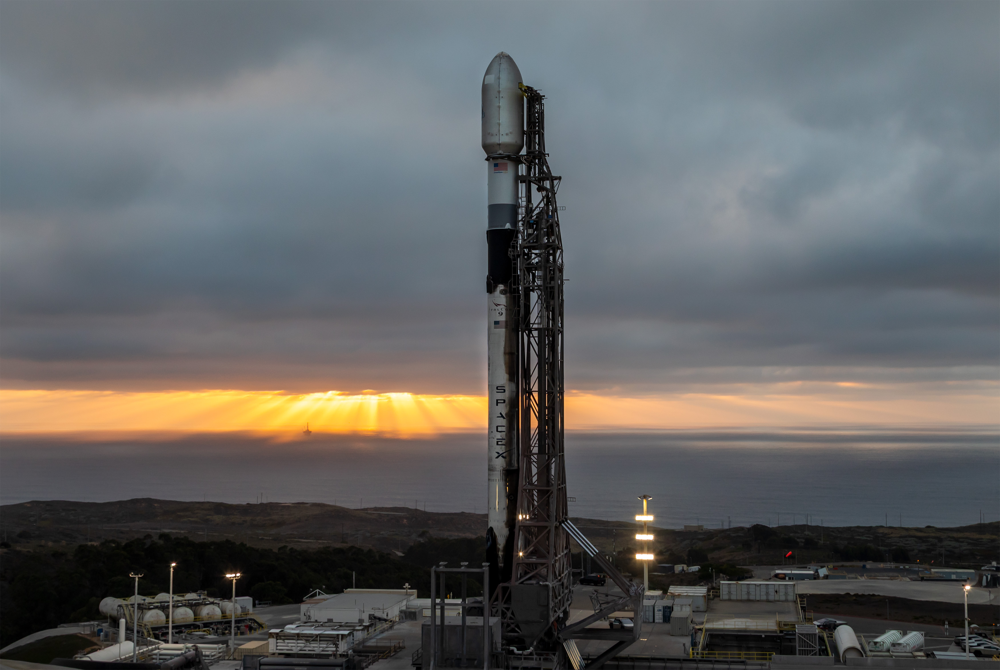
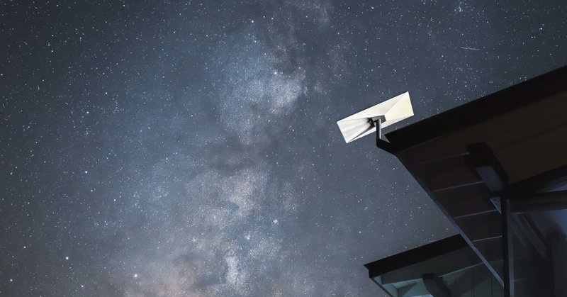

# 🐦 @elonmusk

## 📅 October 10, 2026

> 28 post(s) archived.

---

### 🕐 16:06 UTC · @elonmusk

> Electricity production is the best metric for the true strength of any large-scale economy imo Energy capacity = economic capacity, in one chart There are no low electricity, rich countries

🔗 [View original post](https://x.com/elonmusk/status/2108952286030356925)

---

### 🕐 15:34 UTC · @elonmusk

> Interesting piece from CEO of Microsoft https://x.com/i/article/2108928845969780736

🔗 [View original post](https://x.com/elonmusk/status/2108944224032825761)

---

### 🕐 14:56 UTC · @elonmusk

> Software is just fancy data labeling now To build the characters for http://botpfp.com, I sourced inspiration from X I had @bot scrape examples from @Multi_Serio_Ai&apos;s original post Then I created a swipe interface to judge the characters - the swipes store characteristics, so my cloud agents can see them and build out new looks! The actual items are recreated by @grok, then vectorized so they can be rendered properly. Media build a bot https://botpfp.com

🔗 [View original post](https://x.com/mattyp/status/2108934804028920040)

---

### 🕐 14:35 UTC · @elonmusk

> Ambani runs India’s internet policy. When Starlink won the telecom license and space approval last year, the government still refused to let it sell a single subscription. Before that, Jio lobbied hard to force an auction that would slow any outsider. And after 4 years of paperwork, Musk called out the oligarch and asked if Ambani is the real boss of India. The ministry insists the process is fair and that no monopolies are allowed, yet the world’s biggest telecom still blocks the only system that can reach the villages its own towers will never cover. Starlink already serves Bangladesh, Sri Lanka, and Bhutan. India remains closed. Media The biggest gains from Starlink going from 1 million users to 12 million in 3.5 years went to villages, islands, farms, ships, and disaster zones that towers don’t reach. Ukraine kept links up under bombardment. Clinics, schools, and crews stayed online with a dish and a clear sk…

🔗 [View original post](https://x.com/Rothmus/status/2108929414608097425)

---

### 🕐 14:32 UTC · @elonmusk

> Grok @Bot Guys, @bot created an agent telephone support line with @xai voice in ONE DAY for my @shopify store. It can check order status, make modifications, loop in a human rep and provide information about our products to callers. We&apos;ve never had phone support and our customers will fina…

🔗 [View original post](https://x.com/elonmusk/status/2108928554314711097)

---

### 🕐 14:25 UTC · @elonmusk

> Join @TeslaSI if you’re interested in solving generalized real-world super intelligence! We’re making interesting progress here. Digital Optimus can play about halfway through the Diablo campaign so far just by looking at the screen like a human. Skill at Counter-Strike and other fast games is good too. League is also in training. Goal is to generalize across all gam…

🔗 [View original post](https://x.com/elonmusk/status/2108926853230493843)

---

### 🕐 13:48 UTC · @elonmusk

> Elon Musk was asked why he built SpaceX and Tesla His answer reveals the deeper purpose behind everything he built: “SpaceX and Tesla are fundamentally intended to improve the probability that the future is good” Tesla → “accelerating sustainable energy” SpaceX → “making life multi-planetary and providing global internet through Starlink” And this is the part that says it all: “These are fundamental goods. The good of those companies will far exceed anything that I do from a charitable standpoint” Not just businesses… missions built to make the future better for all of humanity https://x.com/XFreeze/status/2059907495380857162/video/1 Media

🔗 [View original post](https://x.com/XFreeze/status/2108917487278649470)

---

### 🕐 13:28 UTC · @elonmusk

> It’s feeling really magical inside of Shopify right now. It’s clearly the greatest time in the history of tech industry right now. I hope it feels similar everywhere else.

🔗 [View original post](https://x.com/tobi/status/2108912617565675798)

---

### 🕐 11:59 UTC · @elonmusk

> Voici mon socle philosophique. On me demande souvent si je suis croyant. La réponse honnête, c&apos;est que je suis agnostique. Mais pas un agnostique tiède, qui hausse les épaules et passe à autre chose. Un agnostique entièrement tourné vers une seule obsession : chercher la vérité et comprendre l&apos;univers. Ça repose sur quelques convictions simples. D&apos;abord, il existe une vérité, et elle mérite qu&apos;on lui consacre sa vie. Je ne prétends pas la posséder. Je prétends la chercher. Pour ça, je n&apos;ai pas trouvé de meilleure méthode que celle de Socrate : questionner sans relâche, à commencer par ses propres certitudes. Savoir qu&apos;on ne sait pas, c&apos;est le point de départ de toute vraie connaissance. Celui qui a déjà toutes les réponses, qu&apos;il soit dogmatique religieux ou matérialiste intégriste, a arrêté de penser. Ensuite, il y a de la vérité dans tout, et là où il y a de la vérité, la beauté émerge. Je crois profondément qu&apos;une forme de beauté objective existe. Le visage d&apos;une belle femme, une symphonie qui sonne juste, une équation élégante, une cathédrale, un coucher de soleil sur la côte bretonne. Ce n&apos;est pas qu&apos;une question de goût. Quand quelque chose est vrai, harmonieux, bien construit, presque tout le monde le reconnaît. La beauté est le signal que l&apos;on touche à quelque chose de juste. Cela implique de refuser la laideur. Pas par snobisme, mais par exigence. On s&apos;est habitués à vivre entourés de choses moches : une architecture sans âme, des objets jetables, des systèmes absurdes. Je pense qu&apos;une civilisation saine doit construire des systèmes qui tendent vers la beauté. Et la bonne nouvelle, c&apos;est qu&apos;il existe une infinité de beautés possibles. On n&apos;a pas fini d&apos;en créer. Cette beauté ne s&apos;arrête pas aux formes, elle existe aussi dans les idées. Une idée vraie a souvent quelque chose d&apos;élégant. C&apos;est pour ça que je trouve les idées économiques fondées sur la liberté si convaincantes, de l&apos;école autrichienne de Hayek et Mises jusqu&apos;à Milton Friedman. Elles partent d&apos;un principe simple : des individus libres, qui échangent librement, créent spontanément un ordre que personne n&apos;aurait pu planifier. Il y a là une beauté d&apos;horloger. Et à mes yeux, il n&apos;y a rien de plus beau que la liberté individuelle. Enfin, le sens de tout ça, c&apos;est le dépassement de soi. Chercher la vérité, créer de la beauté, défendre la liberté, ce sont trois façons de dire la même chose : devenir plus grand que ce qu&apos;on est aujourd&apos;hui. C&apos;est pour ça que je me sens si en phase avec le projet d&apos;Elon Musk. Au fond, son projet n&apos;est ni technologique ni commercial. C&apos;est un projet de dépassement. Aller sur Mars, construire une intelligence capable de comprendre l&apos;univers, rendre la conscience multiplanétaire. Il s&apos;agit de continuer à jouer le jeu, de repousser la frontière, de découvrir ce qu&apos;il y a derrière. Je n&apos;ai pas besoin d&apos;un dogme pour donner un sens à ma vie. J&apos;ai besoin d&apos;une direction. La mienne tient en une phrase : chercher la vérité, tendre vers la beauté, et comprendre l&apos;univers tant qu&apos;il reste quelque chose à comprendre. Mine de rien, je pense qu&apos;Elon Musk est en train de poser les bases d&apos;une philosophie extrêmement solide. Et très peu de gens l&apos;ont remarqué. Petit retour en arrière. Le christianisme nous a laissé un socle de valeurs qui a rendu possible tout le reste. Il y avait la dignité de l…

🔗 [View original post](https://x.com/brivael/status/2108890148230324351)

---

### 🕐 11:53 UTC · @elonmusk

> Mine de rien, je pense qu&apos;Elon Musk est en train de poser les bases d&apos;une philosophie extrêmement solide. Et très peu de gens l&apos;ont remarqué. Petit retour en arrière. Le christianisme nous a laissé un socle de valeurs qui a rendu possible tout le reste. Il y avait la dignité de l&apos;individu et la valeur du travail. Il y avait aussi l&apos;idée que le monde est ordonné, donc intelligible. Les premiers scientifiques cherchaient à lire les lois d&apos;un créateur. Sans ce socle, il n&apos;y aurait pas eu de méthode scientifique ni de révolution industrielle. Puis Nietzsche arrive : Dieu est mort. Et il ne le dit pas en triomphant. Il prévient : on vient de scier la branche sur laquelle on était assis, et rien ne la remplace. Ce qui vient après, c&apos;est le nihilisme. 150 ans plus tard, on y est. Le débat public est coincé entre deux camps qui ne se parlent plus. D&apos;un côté, des religieux qui défendent des dogmes que beaucoup ne peuvent plus croire au pied de la lettre. De l&apos;autre, un matérialisme intégriste qui croit avoir déjà tout compris. Pour lui, l&apos;univers est une machine et la conscience une illusion, donc il n&apos;y a rien de plus à chercher. Ce deuxième intégrisme est à mon avis le plus dangereux, parce qu&apos;il se fait passer pour de la science. Or la vraie science ne ferme jamais une question. Et la conscience est probablement la plus grande question ouverte qui existe. Personne ne sait ce que c&apos;est. Prétendre le contraire, ce n&apos;est pas du scepticisme, c&apos;est un dogme. C&apos;est là que l&apos;approche d&apos;Elon devient intéressante. La mission de xAI, c&apos;est de comprendre la vraie nature de l&apos;univers. Ça ressemble à un slogan, mais c&apos;est en réalité une philosophie complète. Elle dit trois choses. Il existe une vérité. Elle vaut la peine d&apos;être cherchée. Et la chercher est la chose la plus noble qu&apos;une civilisation puisse faire. Ça rejoint directement la phrase la plus puissante du christianisme : « La vérité vous rendra libre. » C&apos;est la même boussole morale, mais sans obligation d&apos;adhérer à un dogme. En même temps, le scepticisme scientifique reste le moteur. On ne présuppose pas la réponse, on la découvre. Ce n&apos;est ni l&apos;Église, ni le matérialisme. C&apos;est une troisième voie. Et elle convient parfaitement à quelqu&apos;un d&apos;agnostique, qui dit simplement : je ne sais pas encore, mais je veux savoir. Maintenant, ajoutez la superintelligence. Pour la première fois, on va avoir un outil capable de s&apos;attaquer aux questions qu&apos;on a mises de côté depuis des siècles, faute de moyens. Quelle est la nature de l&apos;espace et du temps ? Qu&apos;y a-t-il sous la physique qu&apos;on connaît ? Qu&apos;est-ce que la conscience humaine, réellement ? Chacune de ces réponses sera un bond en avant comparable à Newton ou Einstein. Peut-être plus grand encore. C&apos;est exactement la philosophie dont a besoin une civilisation qui veut monter sur l&apos;échelle de Kardashev. Une civilisation de type 2 maîtrise l&apos;énergie de son étoile, une civilisation de type 3 celle de sa galaxie. On n&apos;y arrive pas avec du nihilisme, ni avec des dogmes figés. On y arrive avec une curiosité sans limite et de l&apos;humilité face à ce qu&apos;on ne sait pas. Il faut aussi la conviction que la vérité vaut tous les efforts. Nietzsche avait posé la question : par quoi remplacer Dieu comme source de sens ? La réponse est peut-être sous nos yeux. Ce n&apos;est pas une nouvelle religion, c&apos;est une quête : comprendre l&apos;univers. Understand the universe with Grok

🔗 [View original post](https://x.com/brivael/status/2108888706857812372)

---

### 🕐 08:00 UTC · @elonmusk

> Alex Gibney’s new four-hour documentary is so determined to expose the billionaire’s failings that it inadvertently showcases the achievements that made him a titan, writes Liel Leibovitz. https://www.thefp.com/p/elon-musk-new-documentary-enemies-best-case?utm_campaign=trueanthem&amp;utm_medium=organic-social&amp;utm_source=twitter

🔗 [View original post](https://x.com/TheFP/status/2108829938992271680)

---

### 🕐 07:48 UTC · @elonmusk

> Falcon 9’s first stage lands on LZ-4 Media

🔗 [View original post](https://x.com/SpaceX/status/2108826911359050211)

---

### 🕐 07:41 UTC · @elonmusk

> Liftoff! Media

🔗 [View original post](https://x.com/SpaceX/status/2108825295310475381)

---

### 🕐 07:26 UTC · @elonmusk

> Watch Falcon 9 launch the @SemperCitiusSDA’s fourth Tranche 1 data transport mission to low-Earth orbit https://x.com/i/broadcasts/1jGXgBoBYkRKZ

🔗 [View original post](https://x.com/SpaceX/status/2108821569225310335)

---

### 🕐 07:07 UTC · @elonmusk

> SpaceX is once again stepping up to help people affected by natural disasters ❤️ Following the earthquake in Panama, SpaceX is providing FREE Starlink internet service through November 10 to customers in affected areas SpaceX is also offering free replacements for damaged Starlink kits And through its partner +Móvil, Starlink Mobile is enabling satellite SMS nationwide for 48 hours in areas without traditional cellular coverage, helping people stay connected with their loved ones When disasters strike and traditional networks fail, Starlink becomes a lifeline for people who need help the most This is why Starlink is such an important, life-saving technology ❤️

🔗 [View original post](https://x.com/XFreeze/status/2108816769477689796)

---

### 🕐 06:57 UTC · @elonmusk

> .@Starlink will revolutionize India, particularly rural areas with no internet. So I made a petition just for Indian villagers who currently have NO INTERNET to show how much they want and need Starlink. https://starlinkforindia.grok.me/

🔗 [View original post](https://x.com/DavidMKeyes/status/2108814248629424308)

---

### 🕐 06:50 UTC · @elonmusk

> Less than one hour until Falcon 9’s launch of the @SemperCitiusSDA&apos;s fourth Tranche 1 mission from California. Weather is 80% favorable for liftoff, and propellant load will begin shortly → https://spacex.com/launches/sda-t1tl-a

🔗 [View original post](https://x.com/SpaceX/status/2108812445557084274)

---

### 🕐 04:51 UTC · @elonmusk

> Yesssss post before you talk yourself out of it

🔗 [View original post](https://x.com/elonmusk/status/2108782334980096377)

---

### 🕐 04:50 UTC · @elonmusk

> Good writer I stepped out of &quot;Musk,&quot; an operatically stupid four-hour hit piece, admiring @elonmusk more than ever before. It&apos;s an inadvertant love song to American innovation as told by the dumb losers who build nothing and complain about everything. https://www.thefp.com/p/elon-musk-new-do…

🔗 [View original post](https://x.com/elonmusk/status/2108782131845755156)

---

### 🕐 04:23 UTC · @elonmusk

> Super Persuasion Media

🔗 [View original post](https://x.com/elonmusk/status/2108775514194473144)

---

### 🕐 03:54 UTC · @elonmusk

> Obviously @ArthurMacwaters I stole the plan from @SouthPark

🔗 [View original post](https://x.com/elonmusk/status/2108768021527613825)

---

### 🕐 03:23 UTC · @elonmusk

> 🇻🇪 Starlink in Venezuela! 🇻🇪 BREAKING: Venezuela’s telecom regulator, Conatel, has officially authorized Starlink to provide satellite internet nationwide. 🇻🇪 After June’s earthquakes damaged phone and internet networks, Starlink provided more than 1,600 kits to support rescue teams, medical staff and huma…

🔗 [View original post](https://x.com/elonmusk/status/2108760362082316674)

---

### 🕐 02:20 UTC · @elonmusk

> Today, @arthurwallen2 and I were driven by the CyberCab at the @Tesla Gigafactory Texas. Besides being driverless, Art was also impressed by the huge trunk. Two highly knowledgeable and enthusiastic engineers gave us a marvelous tour of the factory, witnessing the innovation and technology that Tesla is utilizing in this state of the art location. Thank you, @elonmusk

🔗 [View original post](https://x.com/mayemusk/status/2108744442983153758)

---

### 🕐 00:58 UTC · @elonmusk

> Super Intelligent Beauty hello, world

🔗 [View original post](https://x.com/elonmusk/status/2108723938578530493)

---

### 🕐 00:55 UTC · @elonmusk

> 10 people died in the DC sniper attacks after immigration officials released an illegal Jamaican teenager that Border Patrol had already flagged for deportation in 2001. When agents arrested Lee Boyd Malvo and his mother in Bellingham, they recommended he stay locked up pending removal. Instead, the Seattle INS office cut him loose on a $1,500 bond in January 2002, after which he linked up with John Allen Muhammad and the pair spent the next 9 months preparing the modified Caprice they used to kill from the trunk. Muhammad was executed in 2009. Malvo, 17 at the time of the shootings, received life sentences in Virginia and Maryland and has spent years litigating to cut them. Maryland’s highest court refused his latest appeal in August 2026. Media

🔗 [View original post](https://x.com/Rothmus/status/2108723066066887056)

---

### 🕐 00:33 UTC · @elonmusk

🔗 [View original post](https://x.com/elonmusk/status/2108717598196244828)

---

### 🕐 00:25 UTC · @elonmusk

> Grok @Bot can make a sim of anything The Battle of Cannae and the double envelopment that almost destroyed Rome. Made with @bot

🔗 [View original post](https://x.com/elonmusk/status/2108715608846004414)

---

### 🕐 00:11 UTC · @elonmusk

> For those impacted by the earthquake in Panama, Starlink is providing free service through November 10 to new and existing customers in the affected areas. We are coordinating with emergency response agencies to help restore connectivity in the hardest-hit communities → http://starlink.com/support/article/fb3c70ea-4b79-1d07-5021-e4fba40152d5

🔗 [View original post](https://x.com/Starlink/status/2108712075371712825)

---
