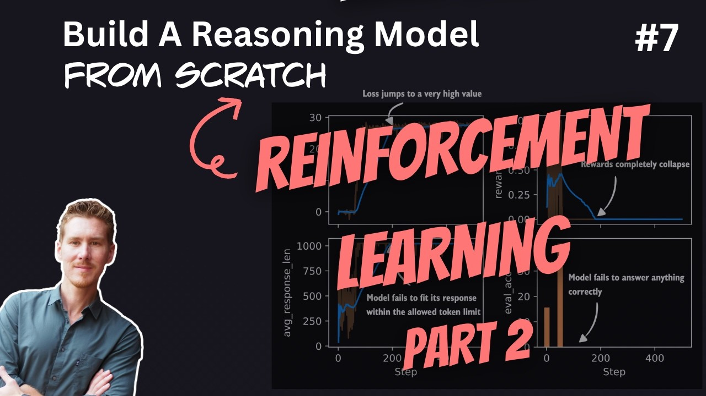

# 🐦 @rasbt

## 📅 October 10, 2026

> 2 post(s) archived.

---

### 🕐 13:13 UTC · @rasbt

> Reasoning From Scratch: Reinforcement Learning with Verifiable Rewards (RLVR) round 2. Covering clipped policy ratios, KL loss term, format rewards, and other GRPO tips &amp; tricks. 00:00 Introduction and recap 01:52 Interpreting basic GRPO training metrics 06:34 Planned improvements to GRPO 08:58 Running longer training jobs with Python scripts 13:39 Running the baseline GRPO training script 17:29 Loading and plotting training logs 19:29 Diagnosing unstable training 23:55 Evaluating checkpoints on MATH-500 26:26 Downloading existing checkpoints 30:09 Tracking advantage statistics 34:53 Understanding entropy 40:32 Computing entropy in PyTorch 44:17 Interpreting entropy values 48:58 Adding entropy tracking to GRPO 53:36 Analyzing advantage and entropy metrics 56:18 Stabilizing GRPO with clipped policy ratios 1:03:27 Implementing the clipped policy loss 1:09:39 Analyzing clipped policy training results 1:11:25 KL divergence and reward hacking 1:15:12 Adding a KL loss term 1:20:34 Limitations of the simplified KL loss 1:23:04 Format rewards and think tags 1:25:47 Adding special tokens to the tokenizer 1:30:29 Implementing the format reward 1:35:56 Analyzing format reward training 1:38:25 Rewarding format only for correct answers 1:40:48 Further GRPO improvements from research 1:45:43 Next steps and distillation Media

🔗 [View original post](https://x.com/rasbt/status/2108908657786355788)

---

### 🕐 13:13 UTC · @rasbt

> And here&apos;s the YouTube version: https://www.youtube.com/watch?v=VxfUrUrrczs

🔗 [View original post](https://x.com/rasbt/status/2108908658512036220)

---
