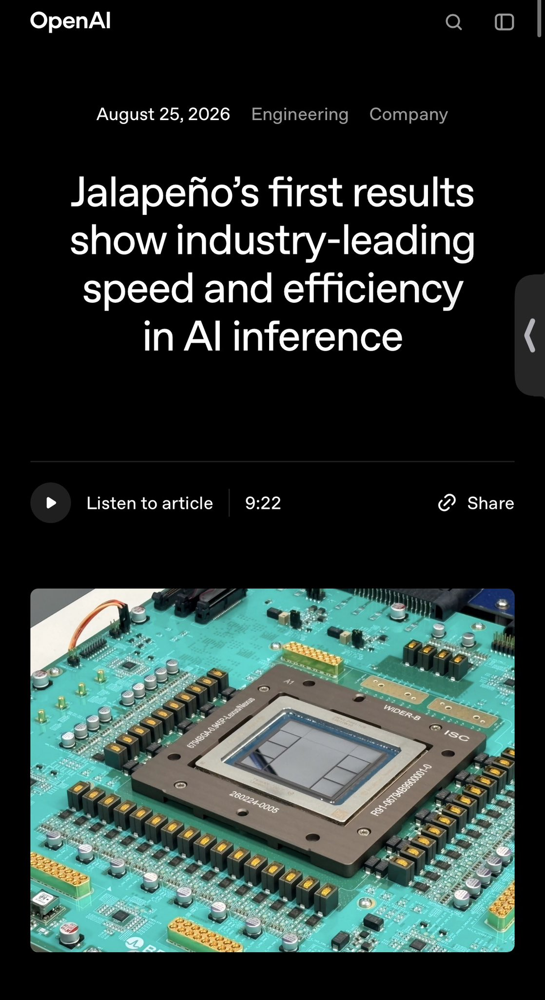
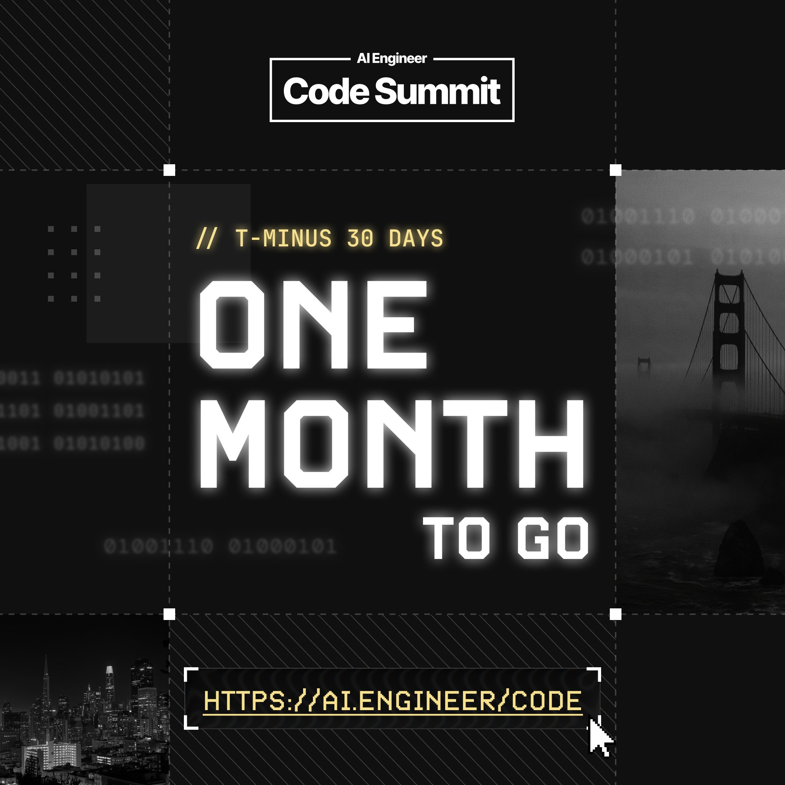
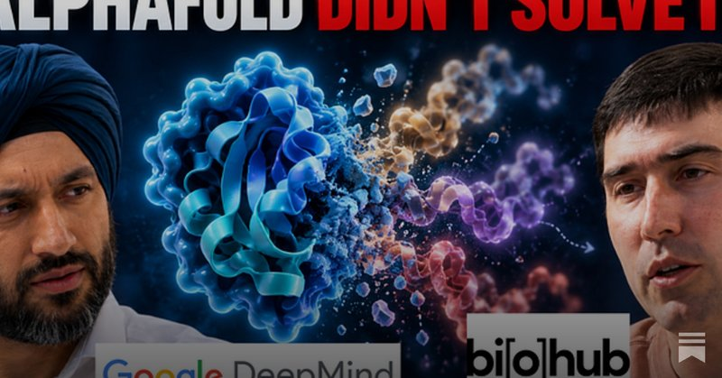

# 🐦 @swyx

## 📅 October 10, 2026

> 6 post(s) archived.

---

### 🕐 13:30 UTC · @swyx

> if you didnt immediately think of counterexamples you are not exercising your own free will and independent thought while reading feedslop Lucky coincidence the labs are only successfully cracking esoteric math problems and not the problems where a solution would give the winner an asymmetric commerical advantage.

🔗 [View original post](https://x.com/swyx/status/2108913080893579342)

---

### 🕐 13:00 UTC · @swyx

> One month to go until AI Engineer Code Summit SF! Three days of technical talks, live demos and conversations with engineers building AI coding tools. November 10 to 12, San Francisco. Ticket applications and sponsorships are open. https://ai.engineer/code

🔗 [View original post](https://x.com/aiDotEngineer/status/2108905391321190446)

---

### 🕐 07:05 UTC · @swyx

> Full breakdown by @swyx: https://www.latent.space/p/biohub-deepmind

🔗 [View original post](https://x.com/xMr_Unoriginalx/status/2108816137781678320)

---

### 🕐 06:46 UTC · @swyx

> we actually briefly sold out of all tix today but i just released 200 overflow so yeah get on this guys aie nyc tix will sell out this weekend - last call to join us to the biggest ever technical conf in New York and our first with a finance mainstage - in some ways the final unification of both my careers: from investment bank to hedgefund, from bigtech to nyc startup. cya monday!

🔗 [View original post](https://x.com/swyx/status/2108811501360320985)

---

### 🕐 04:45 UTC · @swyx

> aie nyc tix will sell out this weekend - last call to join us to the biggest ever technical conf in New York and our first with a finance mainstage - in some ways the final unification of both my careers: from investment bank to hedgefund, from bigtech to nyc startup. cya monday! Leadership tickets for AI Engineer New York 2026 are sold out. Thank you to everyone joining us. Engineering tickets are still available for Oct 12-14. https://ai.engineer/nyc/2026#tickets

🔗 [View original post](https://x.com/swyx/status/2108780918060036335)

---

### 🕐 00:05 UTC · @swyx

> hey this is kind of what my talk will be about! on a related note, there&apos;s been some chatter recently about software engineering skills (eg the ruby/rust/elixir drama). i&apos;m a bit torn because while i do feel like they&apos;re software engineering principles and patterns are still important, at the same time i wonder if there will c…

🔗 [View original post](https://x.com/jediahkatz/status/2108710581490328010)

---
