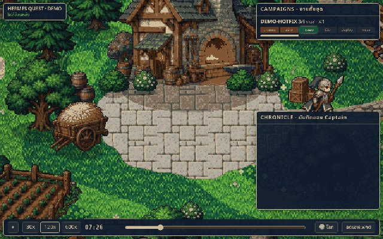

# 🐦 @tonysimons_

## 📅 October 10, 2026

> 2 post(s) archived.

---

### 🕐 01:24 UTC · @tonysimons_

> Another week full of exciting updates for Hermes! Hermes Agent got several convenient updates this week you may not even be aware of! I made a quick video demoing a few of them: - Voice Chat auxiliary model for faster voice conversations - Get local model recs that fit your hardware with hermes model - Install plugins and skills…

🔗 [View original post](https://x.com/tonysimons_/status/2108730231787851814)

---

### 🕐 00:00 UTC · @tonysimons_

> Still a community beta (v0.1.0), not in the official catalog yet. Pull request: https://github.com/NousResearch/hermes-agent/pull/135744

🔗 [View original post](https://x.com/tonysimons_/status/2108709156379148341)

---
