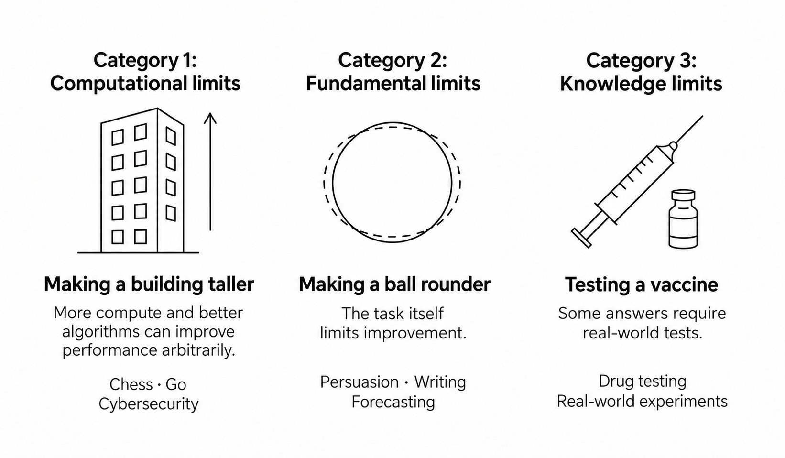

# 🐦 @ylecun

## 📅 October 10, 2026

> 3 post(s) archived.

---

### 🕐 06:28 UTC · @ylecun

> Happy birthday to Thelonious Monk, born on this day in 1917! Media

🔗 [View original post](https://x.com/SVG__Collection/status/2108806778385494242)

---

### 🕐 02:19 UTC · @ylecun

> Do we live in a world where AIs can be wildly superhuman at every single task? Or a world where different tasks have different inherent limits, and AI’s superhuman performance at cybersecurity and math won’t translate to many consequential tasks? This is a key crux that distinguishes the normal technology worldview from the superintelligence worldview, and it has nothing to do with the pace of AI progress — it&apos;s about our different assumptions about the world. Here&apos;s an intuition pump for why I think it&apos;s the second world: different tasks have different fundamental limits. *Category 1: Some tasks are like making a building taller*: there is no ceiling to how well you can do. More compute and better algorithms can lead to wildly superhuman performance. The entire history of computing is the history of building tools that allow us to be “superhuman” at computational tasks. For example, compilers are superhuman assembly code writers, and fuzzing tools are superhuman vulnerability detectors. AI builds on a long line of such improvements: solving math problems and finding exploits in code are two recent examples. *Category 2: Some tasks are like making a ball rounder*: there is only so much room for improvement, and the best AI systems can’t wildly exceed humans. Take persuasion. Some people believe AI can persuade anyone of anything, even convincing military commanders to launch nuclear weapons. In fact, “superpersuasion” is one of the pathways through which many catastrophic risk scenarios unfold. But the AI as Normal Technology thesis is that there are many consequential tasks that are limited by external factors, so such wildly superhuman performance is not possible. This is especially true against humans who use simple computational tools. Tasks like persuasion, or predicting the outcomes of social events (such as elections), fall into this category. Other tasks, like writing, can’t be ranked on a single scale; different people find different writing styles compelling. AI writing also quickly wears thin: even if a user is impressed by AI writing at first glance, after reading thousands of words of the same type of prose, it becomes mundane and irritating. All of these are different from Category 1 tasks like playing chess, where even expert humans can’t do much better than deferring to an AI system at each turn. *Category 3: Some tasks require experiments in the real world*, and the bottleneck isn’t the computational task; it’s the data collection. One example is Moderna’s Covid vaccine: it took two days to design the vaccine, but almost a year to test and authorize, even during a record-breaking vaccine-development effort! This is why a “superintelligence” won’t cure cancer from inside a datacenter: the bottleneck to many of AI’s most sought-after real-world impacts (such as developing cures to diseases) is in the real world, and requires experiments that we won’t (and shouldn’t) hand over to AI. People concerned about AI risks often assume that we live in a world where almost everything fits into Category 1, and we might soon see AIs with wildly superhuman performance at all tasks. I agree it would be scary to live in that world. One reason @random_walker and I are more optimistic about our ability to remain in control is that we don’t think we live in the Category 1 world.

🔗 [View original post](https://x.com/sayashk/status/2108744168222969911)

---

### 🕐 00:43 UTC · @ylecun

> Massive march in NYC protesting MASKED ICE thugs dressed as construction workers who shoot unarmed Americans first, then (don’t) ask later. Fuck ICE. Media

🔗 [View original post](https://x.com/mjfree/status/2108720114468360215)

---
